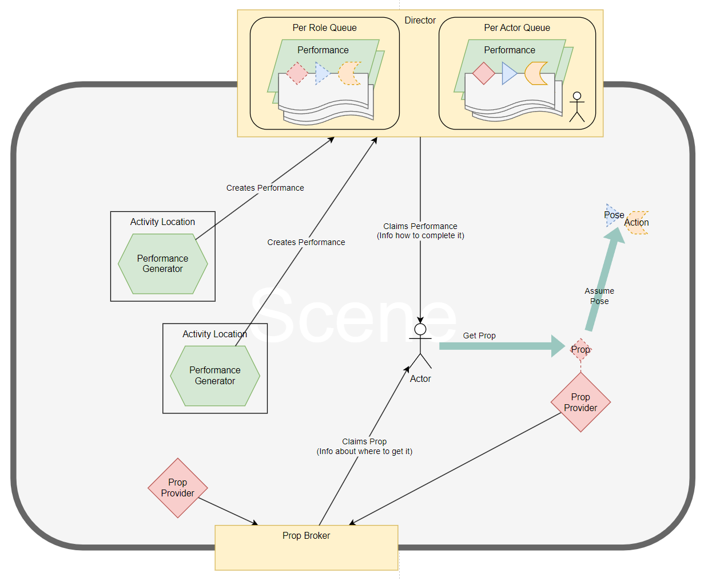

# Machinery.Acting

## Overview

`Machinery.Acting` is a system to schedule actor performances. Performances are sequences of gestures. Gestures are actions that take place in a specific pose. A pose is a location paired with a rotation. Consequently acting facilitates the playback of actions in specific locations. The acting system can be used to implement AI behaviour in games.

### Performances

The acting system does not care about what actions are performed or how an actor gets to their correct pose. It merely defines the sequence of the poses, actions and tracks all performances registered with it.

At any time, any system may schedule a new performance. Also at any time, an actor may claim a performance (based on
priority) and execute it.

The ticking/execution of a performance is left to the systems that use the acting system. Whatever a performance does
is supposed to be fully transparent (invisible) to the actor and acting system overall. If actors and system need to communicate through the acting system they should do so through props (see below) or callbacks and type parameters on the Director instance.

An actor may generate performances and execute them outside the acting system (without telling the director). This can
be used as a simple way to handle local behaviours through the same implementation as coordinated behaviour.

Performances are useful for declaring planned behaviours where only the momentary availability of actors is a
variable factor. However in practice it is common that situations need to be evaluated dynamically during gameplay.
In particular if an actor activity depends on the variable availability of a resource, e.g. a tool, key, workstation,
hunger, skill, money or sunshine; all these can be represented simply: as a count in an account, optionally
paired with a location where more of the account's value can be acquired.

### Props

Combining planned actions (performances) with a requirement for an actor to hold a prop while executing them constitutes an expressive language with which plausible agent behaviour can be declared. The implementation of how to acquire the prop can then be left as the responsibility of the executing actor. As a result we have a system where we can draw a clear boundary between what an actor can do (execute performances and collect tokens from locations) and what the other systems of the game can use the actors for (execute actions in locations and perform resource transactions between them). Gameplay an meaning happens in how gestures, locations and props are presented to the player and through the relationships of the actions and transactions the agents are made to perform over time.

### Architecture

|                                 |
|--------------------------------------------------------------------------|
| *The acting system's principal components and their basic interactions.* |

### Limitations

Performances and props can only really be used effectively for declaring behaviour of individual agents and asynchronous
cooperation between them and other systems, to achieve coordinated, linear, multi-agent behaviour, for example specific
character agents sharing a specific vehicle agent to take a trip to a specific location is not easily represented with
it and out of scope of the acting system.

## Usage example

A very simple example of an Actor going to fix a broken water pipe. Illustrates the fundamental usage and API of
the acting system. Note the callback whenever the enumerator moves on to the next gesture. Allowing the performing

```cs
public static class Planner {
    public static readonly Director<object, Role, IActor> Director = new ( getRoles: actor => new[] {Role.Default} );
}

public enum Role {
    Default
}

public class Actor : MonoBehaviour, IActor {
    private enum Mode {
        Perform,
        Move
    }

    private IEnumerator _enum;
    private IPerformance<IActor> _performance;
    private Mode _updateMode;
    private Pose _targetPose;

    Pose IActor.Pose => new ( transform.position, transform.rotation );

    public IInventory<IProp> Inventory { get; } = new Inventory<IProp> ();

    private void Update () {
        if ( _performance == null ) {
            if ( Planner.Director.TryClaim ( this, out _performance ) ) {
                // when the enumerator switches to the next gesture, we pause updating the enumerator and instead
                // move towards the required pose.
                _performance.NextGesture += NextGestureHandler;

                // after registering the callback above, we can now generate the enumerator and start updating it.
                _updateMode = Mode.Perform;
                _enum = _performance.RunAsync ( this );

                void NextGestureHandler ( Performance<IActor> performance, IActor actor ) {
                    _updateMode = Mode.Move;
                    _targetPose = performance.CurrentGesture.Pose;
                }
            }
        }

        switch ( _updateMode ) {
            case Mode.Perform:
                if ( _enum.MoveNext () ) {
                } else {
                    _enum = default;
                    _performance = default;
                }

                break;
            case Mode.Move:
                MoveTo ( _targetPose, Timing.Source.DeltaTime );

                // when we've reached the next pose, we resume updating the enumerator.
                if ( Planner.Director.PoseComparer.Equals ( _targetPose,
                    new Pose ( transform.position, transform.rotation ) ) ) {
                    _updateMode = Mode.Perform;
                }

                break;
            default:
                throw new ArgumentOutOfRangeException ();
        }
    }

    private void MoveTo ( Pose pose, float deltaTime ) {
        transform.position = Vector3.MoveTowards ( transform.position, pose.position, 1f * deltaTime );
        transform.rotation = Quaternion.RotateTowards ( transform.rotation, pose.rotation, 10f * deltaTime );
    }
}

public static class WaterSystem {
    private class Pipe {
        public string Name;
        public Pose Pose;
        public int Durability;
    }

    private static readonly Pipe[] s_pipes = {
        new () {
            Name = "pipe one",
            Pose = new Pose ( Vector3.one, Quaternion.identity ),
            Durability = 100,
        },
        new () {
            Name = "pipe zero",
            Pose = new Pose ( Vector3.one, Quaternion.identity ),
            Durability = 0
        },
    };

    public static void WaterSystemTick () {
        foreach ( Pipe pipe in s_pipes ) {
            if ( pipe.Durability < 100 ) {
                ScheduleRepair ( pipe );
            }
        }
    }

    private static void ScheduleRepair ( Pipe pipe ) {
        Performance<IActor> repairPerformance = new (
            new FunctionalGesture<IActor> (
                duration: 1f,
                pose: pipe.Pose,
                prop: IGesture.NoProp,
                handlers: (
                    onStart: _ => SuspendPump (),
                    onTick: default,
                    onComplete: _ => {
                        Repair ( pipe, 100 );
                        ResumePump ();
                    },
                    onFailed: args =>
                        Debug.Log (
                            $"Actor {args.actor} has failed gesture {args.gesture} as part of performance {args.performance} in {args.gesture.Pose}" ) )
            )
        );
        Planner.Director.Schedule ( key: pipe, performance: repairPerformance );
    }

    private static void SuspendPump () => Debug.Log ( $"Pump suspended" );

    private static void ResumePump () => Debug.Log ( $"Pump resumed" );

    private static void Repair ( Pipe pipe, int amount ) => pipe.Durability += amount;
}
```

